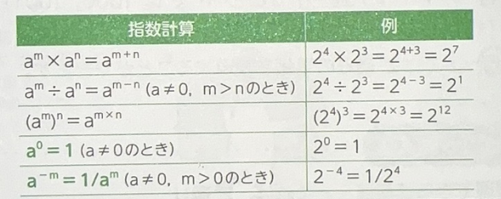
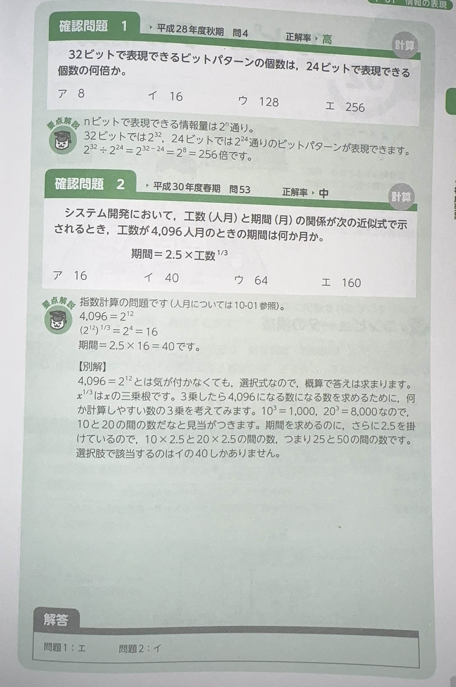

# 情報量の単位

コンピュータで扱う最小の情報量の単位を「ビット」といい

* 8[bit] = 1[byte]
* ビットパターン「bit patten」:表示一组二进制数字的组合。例えば：「10001111」はビットパターン

# 表現可能な情報量

* 1ビットで表現できるな情報量は　「0」「１」　= `2^1` (二的一次方)
* 2ビットで表現できるな情報量は　「00」「01」「11」「10」 = `2^2` (二的一次方)

`Nビットで表現できる情報量とくれば　2^n`

## 大きな数値を表す接頭語

* K「キロ」：　10^3
* M「メガ」：　10^6
* G「ギガ」：　10^9
* T「テラ」：　10^12

単位は`ビット`です

## 小さな数値を表す接頭語

* M「ミリ」　　：　10^-3
* u「マイクロ」：　10^-6
* n「ナノ」　　：　10^-9
* p「ピコ」　　：　10^-12

単位は`ビット`です

# 単語

* 表現　ひょうげん
* 最小　さいしょう
* 扱う　あつかう　待遇 接待 使用 经营 报道
* 接頭語　せっとうご　接头词 前缀
* 数値　すうち
* 表す　あらわす　表现 表达 象征 显示

# 文字の表現

文字コードは、文字の一つひとつが０と１の２進数で表現された識別番号です

`Unicode`とくれば`世界の文字を一つに体系化したもの`

# 単語

* 文字　もじ
* 識別　しきべつ
* 体系　たいけい

# その他

# 

