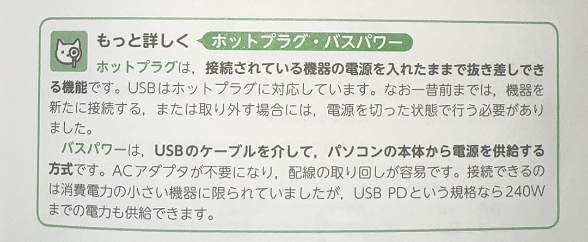

# 入出力インタフェース

PC本体と周辺機器を接続するための規格の総称です

# USB

PCと周辺装置を接続する標準的な「シリアルインターフェイス」(serial interface 串行接口)。

`USBハブ`という集線装置を使えば、最大`１２７`台までの機器を接続できます。

# 単語

* インタフェース　interface 接口 界面
* 機器 きき 「類義語は　機械「きかい」」
* 類義語　るいぎご
* 規格　きかく
* 総称　そうしょう
* 接続　せつぞく 连接 接续 
* 標準　ひょうじゅん
* 集線装置　しゅうせんそうち

# HDMI

映像や音声、制御信号を、一本のケーブルで入出力できるインタフェースです

# Bluetooth
> ブル―トゥ―ス

免許不要の2.4GHz帯の電波利用したインタフェースです。

`100m程度の範囲で最大通信速度は24Mbps`

また、BLEはBluetooth通信方式の一つです.

低消費電力で長時間動作する特徴があり、lOT機器に適しています

# Zigbee
> ジグビー

免許不要の2.4GHZ帯の電波を利用したインタフェースです。

`低コストで低消費電力が特徴です`

LANよりも狭い、数M程度の近距離のIT機器同士が通信するネットワークをPANといいます。

# 単語

* 一本　いっぽん 形容长条形状的物体
* ケーブル cabel　电缆
* 映像　えいぞう
* 電力　でんりょく
* 電波　でんぱ
* 免許　めんきょ 批准 许可
* コスト cost 成本
* 消費　しょうひ
* 同士　どうし同伴 伙伴
* 通信　つうしん
* 近距離　きんきょり
* 範囲　はんい
* 適して　てきして
* 長時間　ちょうじかん

# その他

# 

# 単語

* 抜き差し　ぬきさし　插入拔出
