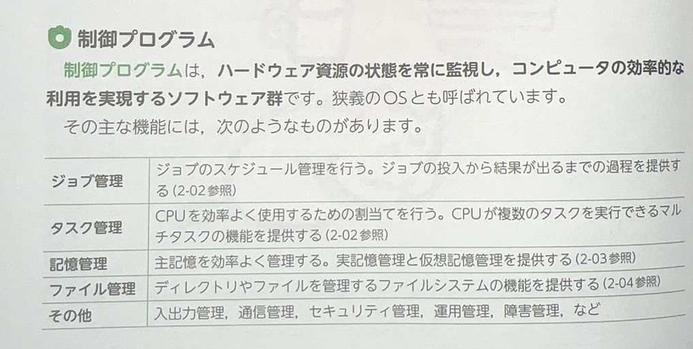
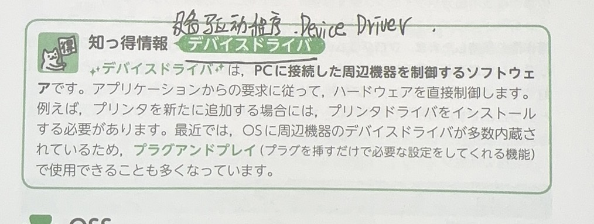
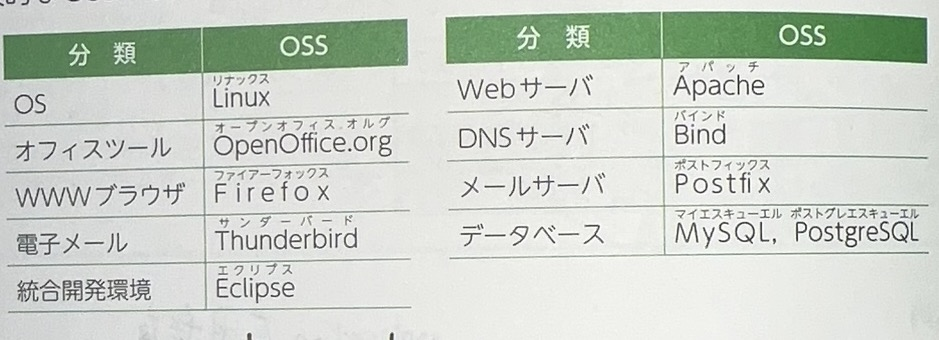
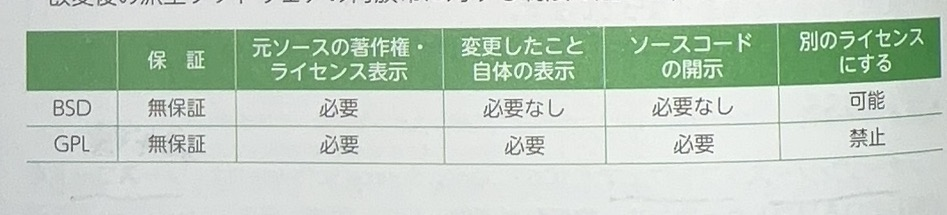
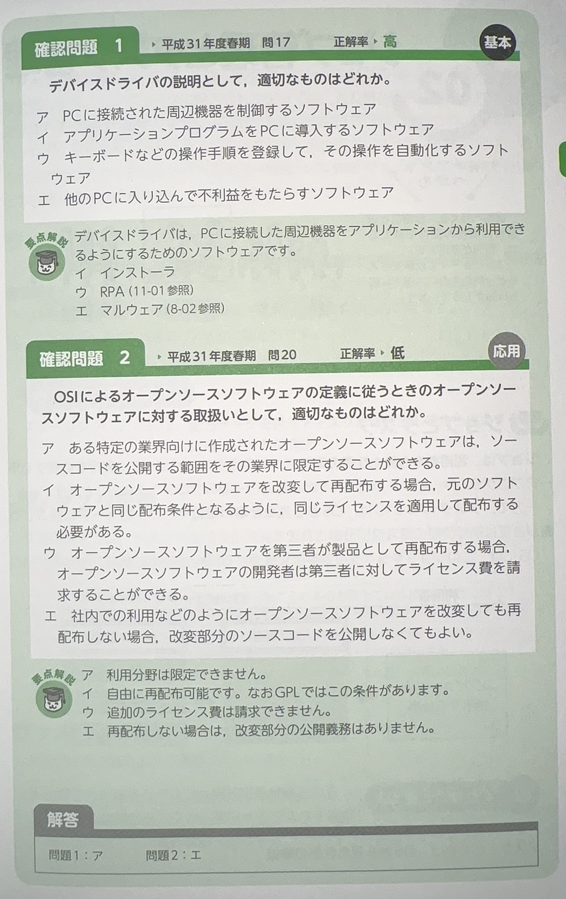
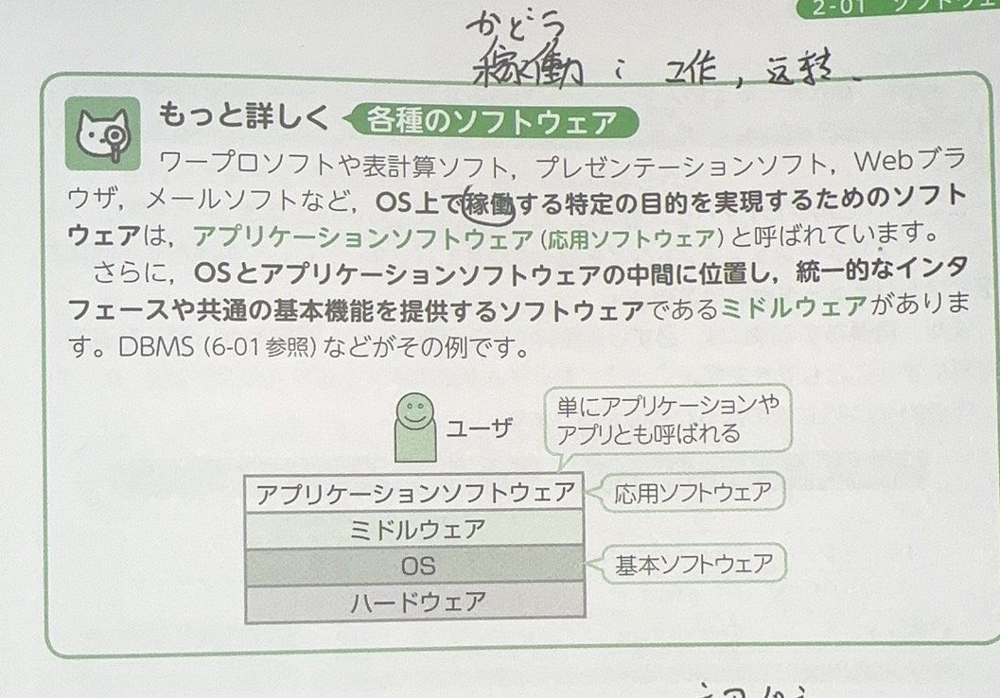

# OS
> オペレーティングシステム

ハードウェアやアプリケーションソフトウェアを管理、制御するソフトです。

# 制御プログラム

ハードウェア資源の状態を常に監視し、コンピュータの効率的な利用を実現するソフトウェア群です。

* ジョブ管理
* タスク管理
* 記憶管理
* ファイル管理
* その他

# 単語

* マルチメディア　多媒体
* 資源　しげん
* 効率　こうりつ
* 群　ぐん
* 監視　かんし

# API

アプリケーションから，OSが用意する各機能を利用するための仕組みです。

# OSS
> オープンソースソフトウェア(oss Open Source Software)

ソースコードを公開しているソフトウェアです。`無保証を原則`として、誰でも自由にソースコードを改変し頒布できることで。

# 単語

* 保証　ほしょう
* 原則　げんそく
* 頒布　はんぷ
* 用意　ようい　
* 仕組み　しくみ　构造 机制
* 

ソースコードを公開しているソフトウェアです。無保証を原則として、誰でむ自由にソースコードを改変し再頒布できる。

# OSSのライセンス

# 単語

* ライセンス　license 许可

#　その他

# 

# 単語

* 表示　ひょうじ
* 変更　へんこう
* 自体　じたい　本身 自身
* 開示　かいじ　宣告 宣布
* 著作権　ちょさくけん