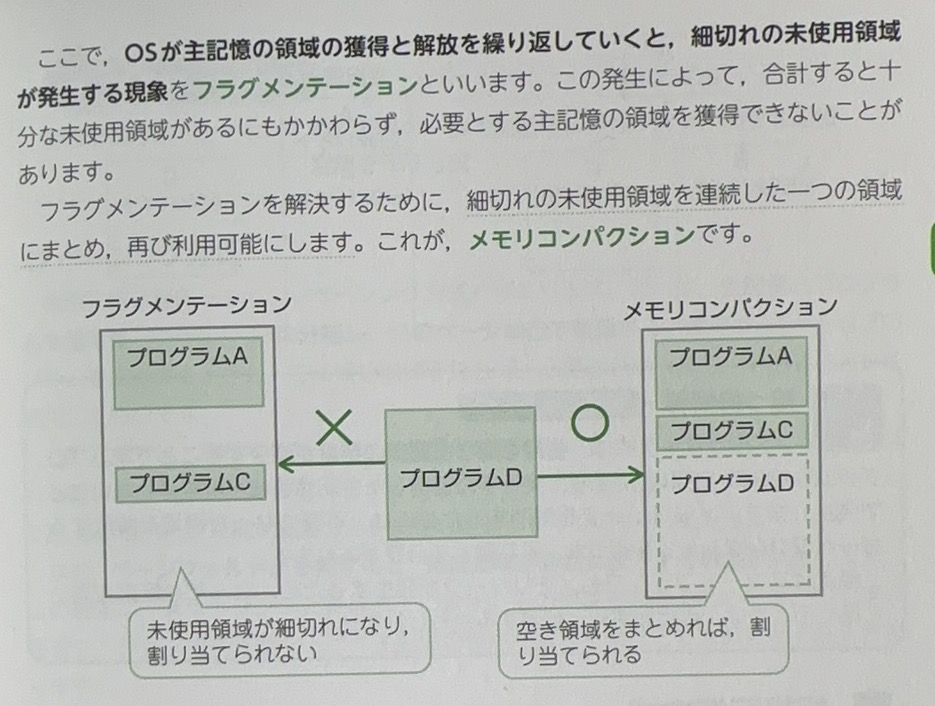

# 記憶管理

プログラム記憶方式は、プログラムを主記憶に読み込んでおき、CPUが順次読み出し実行する方式です。

プログラムは磁気ディスクなどの補助記憶に保存されていますが、実行時には主記憶上に配置し、実行が終われば主記憶上から消去されます「主記憶の解放」

# 実記憶管理

主記憶そのものを効率よく管理するために、次のような方式があります

## 区画方式

# 単語

* 実記憶　真实记忆
* 区画　くかく　区划
* 超　ちょう
* 重要　じゅうよう
* 主記憶　しゅきおく
* 読み込んでおき　预先加载
* 順次　じゅんじ
* 消去　しょうきょ
* 配置　はいち
* 補助　ほじょ
* そのもの　本身的意味
* 次ような　以下几种
* いくつか　几个 一些

# スワッピング方式

主記憶の容量が不足し、複数のプログラムを主記憶上に配置できない場合には、実行中のプログラムのうち優先度の低いプログラムを一時中断して磁気ディスクに退避「スワップアウトという」して、優先度の高いプログラムを主記憶に配置する方式です。

# オーバレイ方式

あらかじめプログラムを同時に実行しない排他的な機つかの単位「セグメントという」に分割しておき、実行時に必要な部分だたを主記憶に配置して実行する方式です。

# 単語

* 複数　ふくすう
* 場合　ばあい
* 低い　ひくい
* 中断　ちゅうだん
* 一時　いっとき
* 退避　たいひ
* 容量　ようりょう
* 不足　ふそく
* 排他　はいた
* 幾つか　いくつか
* 分割　ぶんかつ
* 部分　ぶぶん

# 仮想記憶方式

プログラムを仮想記憶空間に格納しておき、実行時に必要なプログラムやデータを動的に実記憶に配置して実行する方式です

#　単語

* 空間　くうかん
* 動的　どうてき　变化的

# ページング方式

# ページ置換アルグリズム

# 単語

* 置換　ちかん

# その他

