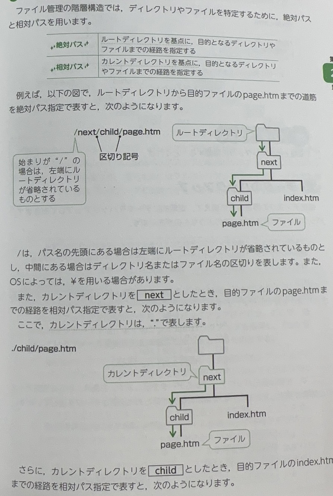

# ファイル管理

ファイルはディレクトを用いて管理されています。

ディレクトリは、ファイルを効率よく管理するために、階層構造になっています。ここで、階層構造の最上位にあるディレクトリといい、ディレクトリの下位に作成されたディレクトは`サブディレクトリ`とよばれています。また、カレントディレクトリは、現在、操作対象であるディレクトリです。

# 単語

* 階層　かいそう
* 上位　じょうい
* 下位　かい
* 

# パス指定
> 意为路径指定或路径设定。在编程或计算机科学领域，它通常指的是对文件或文件夹路径的明确指定。

# 単語

* パス　pass/path/route
